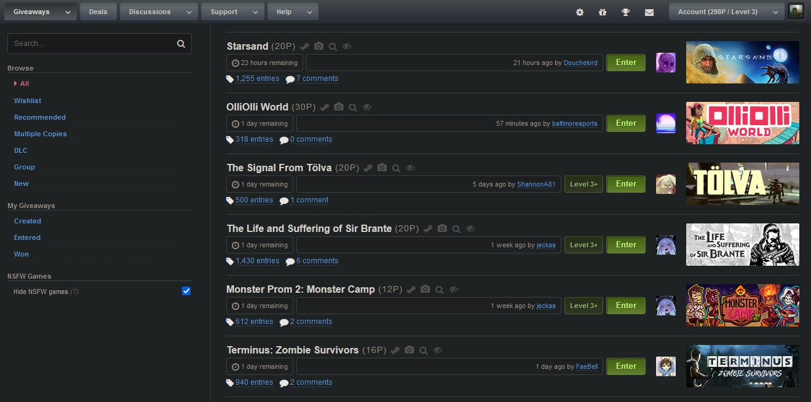
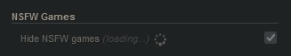
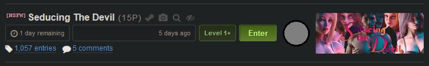

# NSFW games filter for SteamGifts (beta)

Usercript for [SteamGifts](https://www.steamgifts.com/).

Allows to hide giveaways of NSFW games on [SteamGifts](https://www.steamgifts.com/).

## Features
* Hide games with following content descriptors:
  * "Frequent Nudity or Sexual Content",
  * "Adult Only Sexual Content".
* NSFW developers blocklist *(currently empty, check [this](https://github.com/Xeloses/sg-nsfw-filter/discussions/1))*.
* NSFW publishers blocklist *(currently empty, check [this](https://github.com/Xeloses/sg-nsfw-filter/discussions/1))*.
* Whitelist (by AppID, developers and publishers).
* Show count of giveaways of NSFW games on the current page.
* Add a mark to NSFW games in giveaways.
* Save filter state (on/off) in browser' storage *(if cookies and localStorage access are enabled)*.
* Does not hides games with following content descriptors:
  * "Some Nudity or Sexual Content" *(games can have this descriptor, for example, because of feature to manually undress character, or few scenes with swimsuits)*,
  * "General Mature Content" *(games can have this descriptor, for example, because of offensive language, or violence scenes)*.

> **Important**: script can not process games unavailable in your country (because Steam API does not allow to retrieve info about region restricted games)!

### Steamgifts pages processed by script:
* Home page
* Giveaway page
* Giveaways search
* Group' giveaways
* User' giveaways

To reduce the count of requests to the Steam API server (and prevent blocking/blacklisting on that servers) script limits requests to 3 per second and caches results in Tampermonkey storage.

> **Warning**: After istalling (or after some major updates) and while cache is (almost) empty script can takes a time to load games info. It does not impact page loading time, script works separately.

## Compatibility:
* \[+\] Should be compatible with **ESGST** addon *(normal view only)*.

* \[-\] Does not work with grid-view of **ESGST** addon *(ESGST option 3.27)*.
* \[-\] Does not work with endless scrolling of **ESGST** addon *(ESGST option 2.8)*.
* \[-\] Does not work with giveaways extractor of **ESGST** addon *(ESGST option 3.17)*.

## Known issues:
* For packages script takes a game with lowest AppID from this package, and decide status of package (SFW or not) based on the info about this game:
  * if package contains game+dlc(s) - usual game have lower appid than dlcs;
  * but if package contains multiple games - script will analyze info only for one game *(with lowest appid)*.

## Preview
* Filter control (places in the left bar under navigation links):

* Filter control while loading games info:

* NSFW game mark:

## Installation:
1. Install **"Tampermonkey"** addon for your browser:
  * **Google Chrome**: [install](https://chrome.google.com/webstore/detail/tampermonkey/dhdgffkkebhmkfjojejmpbldmpobfkfo)
  * **Mozilla Firefox**: [install](https://addons.mozilla.org/ru/firefox/addon/tampermonkey/)
  * **Opera**: [install](https://addons.opera.com/en/extensions/details/tampermonkey-beta/)
  * **Safari** (MacOS): [install](https://apps.apple.com/us/app/tampermonkey/id1482490089)
  * **IE/Edge**: *not supported*
2. Install userscript: [install](https://raw.githubusercontent.com/Xeloses/sg-nsfw-filter/master/sg-nsfw-filter.user.js)

## Version history:
* 0.0.2.1
  * [+] Whitelist (by AppID, Developer, Publisher)
* 0.0.1.2
  * [+] Save filter state in browser' LocalStorage
  * [+] Marker for NSFW games
* 0.0.1.1
  * [~] Bugfixes.
* 0.0.1.0
  * Beta release.
